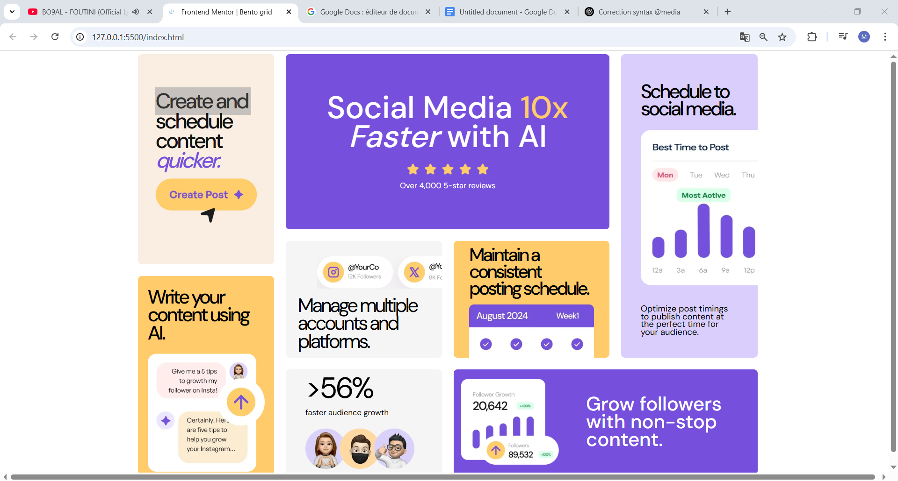

# Frontend Mentor - Bento grid solution

This is a solution to the [Bento grid challenge on Frontend Mentor](https://www.frontendmentor.io/challenges/bento-grid-RMydElrlOj). Frontend Mentor challenges help you improve your coding skills by building realistic projects.

## Table of contents

- [Overview](#overview)
  - [The challenge](#the-challenge)
  - [Screenshot](#screenshot)
  - [Links](#links)
- [My process](#my-process)
  - [Built with](#built-with)
  - [What I learned](#what-i-learned)
- [Author](#author)

### The challenge

Users should be able to:

- View the optimal layout for the interface depending on their device's screen size

### Screenshot

### Links

- Solution URL: [Add solution URL here](https://github.com/mouhcine03/bento-grid.git)
- Live Site URL: [Add live site URL here](https://mouhcine03.github.io/bento-grid)

## My process

starting with building the html file using appropriate names for each element to make it easier , then the grid division and finally style each box separatly

### Built with

- Semantic HTML5 markup
- CSS custom properties
- Flexbox
- CSS Grid

### What I learned

-how to use grid display with grid-templete-areas
-styling images and texts

## Author

-
- Frontend Mentor - [mouhcine03](https://www.frontendmentor.io/profile/mouhcine03)
- linkding - [mouhcine el hasnaoui](https://www.linkedin.com/in/mouhcine-el-hasnaoui-2a22a9294/)
